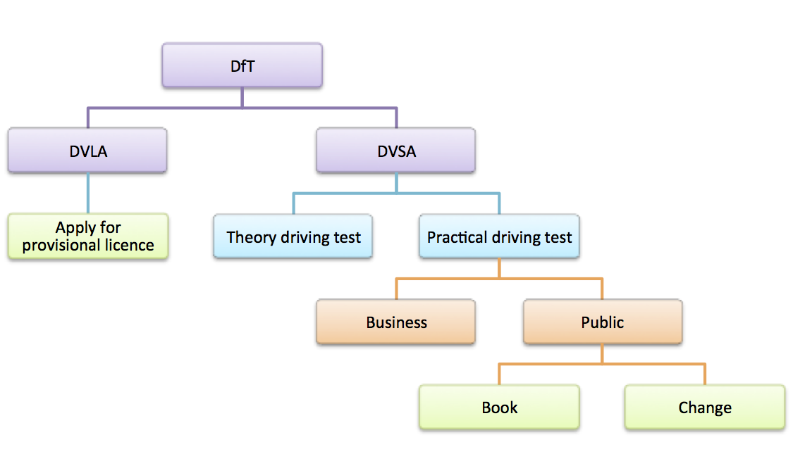

.. _dvsa-practical-driving-test-study:

DVSA Practical driving test dashboards
######################################

This case study shows the process undertaken by the Performance Platform team and the `Practical 
Driving Test`_ service team managed by Martin Richardson in the `Driver and Vehicle Standards Agency`_ (DVSA).

.. contents:: :depth: 3

Service profile
***************
To be able to legally drive a particular type of vehicle on the road, individuals must first apply for a 
provisional licence (if not already covered), book and then pass both a theory and practical driving test.

The practical driving test service operated by the <Driver and Vehicle Standards Agency> (DVSA) enables 
individuals to book, and if necessary check, change or cancel their test is headed up by service manager
Martin Richardson who is responsible for the efficiency and effectiveness of the service for his users.

The service is offered to individuals and businesses separately - the key difference between the offerings
being businesses ability to manage block bookings as a single request.

The service currently handles approximately *1.8 million* bookings and *0.8million* changes per year and cost *£1.6 million*
and *£0.56 million* to operate respectively.  The service is offered to users online, via telephone and by post.  

Over 95% of all requests are currently handled online.

Discovery
*********
The discovery phase covers the initial engagement with the government organization, capturing data about 
how the service operates and identifying initial dashboard metrics that would most assist the service 
manager in improving the service.

This phase captures information about:

* How the service is accessed and presented to users
* How the service is managed by the organization
* Where the identified service sits in context with other associated services
* Identifying the metrics that would add value to the Service Manager in improving the user experience and efficiency of the service
* Understanding the underlying systems architecture and how it supports users

The discovery phase was initiated with a meeting between the performance platform team and the service 
delivery team at what was then the Driving Standards Agency (DSA).  

The Performance Platform was in an early stage of its development and Martin had offered to help shape 
the features of the platform using the practical driving test service as a candidate client. 
 
Initial scope
=============
It was decided at an early stage to focus on the practical driving test service offered to members of the public.  

This service handles the larger volume of transactions, had recently been migrated onto a new application and 
had already been instrumented using Google Analytics (a primary source of performance data).  

Constraints
-----------

* The practical driving test itself is dependent on the type of vehicle the user selects.  It was agreed at this stage the vehicle type was out-of-scope.
* The change/cancel service has a number of types/options for change that the user can select. For the initial dashboard, the specific change the user selects within the service was out of scope
* The implementation of the dashboards and underpinning storage of data should be geared to allowing extension at a later date to include dashboards for the other service options and user types 

User experience
===============
The service is accessed by users from the main <GOV.UK> site:

* Book:  		https://www.gov.uk/book-practical-driving-test
* Change:  	https://www.gov.uk/change-date-practical-driving-test
* Cancel:  	https://www.gov.uk/cancel-practical-driving-test

Support for Welsh language users is also available for bookings:

https://www.gov.uk/archebu-prawf-gyrru-ymarferol

Booking a practical driving test
--------------------------------

User are redirected from GOV.UK to the ‘Book your practical driving test’ start screen at:

https://driverpracticaltest.direct.gov.uk/application?execution=e1s1

The users journey is linear (all stages completed in sequence) and is split into a number of stages.  Users are required to complete all sections and pay for their test:

* Choose the type of vehicle test
* Enter their licence details
* Select a test centre
* Choose a time and date for their test
* Enter their details
* Enter their payment details
* Confirm their information and pay
* Receive confirmation of their booking

On completion, users are redirected back to GOV.UK where they can opt to complete a user satisfaction survey:  

https://www.gov.uk/done/book-practical-driving-test

Change/cancel a practical driving test
--------------------------------------

Users are redirected from both GOV.UK  start pages to the ‘Change your practical driving test’ start screen at:  

https://driverpracticaltest.direct.gov.uk/login

The first user journey stage is to enter their driving licence number and application reference number.  Following validation, the user is able to make individual changes to their booking or cancel it.  Activities users can undertake can include:

* Check booking
* Change type of test
* Change vehicle details
* Change special requirements
* Change instructor reference number
* Change test centre
* Change time and date of test
* Cancel test

On completion, users are redirected back to GOV.UK where they can opt to complete a user satisfaction survey:  

https://www.gov.uk/done/change-date-practical-driving-test

Service context
===============
The context of the Book and Change transactional services offered as part of the broader set of DVSA services can be seen below.

Technical architecture
======================
The IT systems relevant to the in scope services are: 

GOV.UK
------
* Individuals wanting to either book or change their practical driving test start their journey on the GOV.UK site
* Users are redirected from GOV.UK pages to the respective DVSA webapps (see below)
* On completion of the user journey, users are redirected to GOV.UK and have the option of completing a user satisfaction survey
* The site hosts the user satisfaction survey and can provide aggregated quantitative results of completed surveys to the performance platform
* GOV.UK has been instrumented for Google Analytics (GA) 

New Internet Booking System - NIBS
----------------------------------
* NIBS  is a DVSA hosted system and presents all practical driving test services to public users.
* NIBS manages both bookings and changes within the same webapp – users entering via separate start pages dependent on their need.
* NIBS has been instrumented for GA  with user/page and event data captured in GA directly from user browser sessions

Online Booking System – OBS
---------------------------

* OBS  is a DVSA hosted system and presents all practical driving test services to business users.  
* OBS was considered out of scope for this part of the engagement 

DVSA MI mainframe
-----------------

* Management Information data for the practical driving test service is stored on a DVSA legacy mainframe.  
* The mainframe holds information for practical driving across all services and channels.
* Reports are produced from data held in the mainframe via a legacy Crystal Reports application

Google Analytics
----------------

* Analytics data generated during user’s browser sessions whiel using the NIBS application are sent to a single GA profile for both bookings and changes

Metrics
=======
Discussion identified which metrics would prove useful to Martin in spotting opportunities for improvements to the service.
Those metrics being:

* User volumes across the online user journey – providing insight into where users drop out, rely on ‘help’ and completion rates to identify where the journey can be improved
* How users access the service – understanding what types of device and browsers are used for which types of activity to enable focusing the user experience to user preferences
* Volumetrics – tracking use of the service via online and offline channels to allow long term trend spotting and to act as a ‘single source of truth’ 
* Time on transactions – to identify where in the process users are spending longer amounts of time in order to identify where improved guidance should be provided 

The service team expressed a need that separate dashboards will be created for public and business facing services and that focus should be on the public service in the first instance. 

Existing dashboards
===================
The work within this study covers the first dashboards for the practical driving test based on data derived directly from the service implementation.  The DVSA already has the following ‘high volume transaction dashboards’ available on the performance platform:

Practical driving test: bookings 		https://www.gov.uk/performance/dft-book-practical-driving-test
Practical driving test: changes to bookings https://www.gov.uk/performance/dft-amend-practical-driving-test

The data supporting these dashboards is provided by Martin and team and is an overarching set of costs and volumes across both public and business facing variants of the service.

It was decided that at present it would be misleading to present these metrics as part of the public facing service dashboards and a potential higher level dashboard would be a benefit to Martin and his team at a later date.

Analysis
********

The analysis phase of work focuses on how the needs of the Service Manager can be translated into one or more dashboards based on:

* Metrics identified as having value and how they can be presented
* Identified and agreed data sources
* Ability to integrate data sources with the performance platform
* Additional metrics that can be derived 

With the options available, this phase is then evaluated in terms of cost/benefit for the Service Manager and a decision to what/if to proceed with.

Business analysis
=================

With an understanding of how the service(s) operated and how the underpinning IT systems supported the service, a more detailed analysis of what metrics would be both valuable and achievable for the service manager.  This activity brought together the service manager need, the mandatory KPI’s and a set of metrics the performance platform team had identified from previous engagements that could also be derived given the data sources available.

A number of metrics could be derived directly from the data sources identified without ‘intrusive changes’ to existing applications.  Other metrics would require changes to the deployed applications.  Evaluation of the impact and associated cost was considered in this phase.

*NOTE: The following table is the result of a number of iterations of metrics requirements and data availability from the technical analysis (see later section)*

+-----------------------+----------------------------------------+
|                       |Dashboard                               |
+-----------------------+----------+-------------+---------------+
|Metric                 |Overview  |Book service |Change service |
+-----------------------+----------+-------------+---------------+
|Live service usage     |Yes       |No\ :sup:`1` |No\ :sup:`1`   |
+-----------------------+----------+-------------+---------------+
|Breakdown by service   |Yes       |No           |No             |
+-----------------------+----------+-------------+---------------+
|User device type       |Yes       |No\ :sup:`1` |No\ :sup:`1`   |
+-----------------------+----------+-------------+---------------+
|Service availability   |Yes       |Yes\ :sup:`2`|Yes\ :sup:`2`  |
+-----------------------+----------+-------------+---------------+
|Transactions by channel|No        |Yes          |Yes            |
+-----------------------+----------+-------------+---------------+
|User satisfaction      |No        |Yes          |Yes            |
+-----------------------+----------+-------------+---------------+
|Digital take-up        |No        |Yes          |Yes            |
+-----------------------+----------+-------------+---------------+
|Completion rate        |No        |Yes          |Yes            |
+-----------------------+----------+-------------+---------------+
|Users at each stage    |No        |Yes          |Yes            |
+-----------------------+----------+-------------+---------------+
|Help usage             |No        |Yes          |Yes            |
+-----------------------+----------+-------------+---------------+

:sup:`1` - Both Book and Change services running on NIBS report into the same google analytics profile.  At present the ability to differentiate usage at this level has not been investigated 

:sup:`2` - Service availability, while measured at the application level (NIBS) is the same for both Book and Change transactions and so not mis-leading if presented on respective transaction dashboards ain addition to the overview dashboard

Compared to the initial metrics requirements from Martin during the discovery phase, two metrics cannot not be supported on the platform at present:

* Time taken for transaction stages
* Browser usage

Technical analysis
==================
The purpose of the technical analysis phase is to work out the most appropriate sources of data for the metrics to be presented on 
the proposed dashboards.  As well as identifying the sources of the data, this phase determines how the data can be propagated 
into the performance platform and any non-functional issues that need to be addressed e.g. the periodicity of data collection 
and the security requirements around the data itself.

The diagram below shows the key components of the DVSA service along with identified integrations for propagating data into the platform.

.. image:: dvsa-practical-driving-test-architecture.png

Mapping services and channels
-----------------------------

Mapping services and channels provides the contextual of the view of the service and how it is presented to users as well as where 
the specific set of dashboards sit in the context of how the organization operates the services.  Understanding this context allows 
for a more flexible model for collecting and storing data to support the required dashboards

+------------------------+-----------+----------------------+-----------+---------------------+
|Organisational service  |Sector     |Transactional service |Channel    |Digital/non-digital  |
+========================+===========+======================+===========+=====================+
|Practical driving test  |Public     |Book                  |Online     |Digital              |
|                        |           |                      +-----------+---------------------+
|                        |           |                      |Telephone  |Non-digital          |
|                        |           |                      +-----------+---------------------+
|                        |           |                      |Post       |Non-digital          |
|                        |           +----------------------+-----------+---------------------+
|                        |           |Change                |Online     |Digital              |
|                        |           |                      +-----------+---------------------+
|                        |           |                      |Telephone  |Non-digital          |
|                        +-----------+----------------------+-----------+---------------------+
|                        |Business   |Book                  |Online     |Digital              |
|                        |           |                      +-----------+---------------------+
|                        |           |                      |Telephone  |Non-digital          |
|                        |           +----------------------+-----------+---------------------+
|                        |           |Change                |Online     |Digital              |
|                        |           |                      +-----------+---------------------+
|                        |           |                      |Telephone  |Non-digital          |
+------------------------+-----------+----------------------+-----------+---------------------+

Performance Data sources
------------------------

DVSA MI Mainframe
^^^^^^^^^^^^^^^^^

* The DVSA MI mainframe is capable of generating a periodic Practical driving test channel volumetrics report outlining the number of book and change transaction requests for both the public and business services and the channels over which the transaction took place.  
* The report is generated by a legacy reporting tool – Crystal Reports
* The cost of integration from the mainframe discounted a direct integration approach in the timeframe agreed.  This led to a manual upload of volumetrics data approach.  The next challenge was to transform the data from its native Crystal Reports format to the defined Performance Platform format.
* A simple excel based ‘transformer’ was created to allow the service manager to convert the data themselves to the required format for manual upload to the platform.

Google Analytics
^^^^^^^^^^^^^^^^
**NIBS users**

* The NIBS application has been instrumented with Google Analytics, it was agreed the number of users accessing the service should be captured using the Performance Platforms GA real-time collector.
* An issue in the way the practical driving test analytics has been instrumented (shared GA profile for both ‘Book’ and ‘Change’ transactions) meant the number of users active on the Book or Change journey at any time could not be determined at the time.  

**NIBS user journey data**

* User journey data recorded in Google Analytics from the NIBS application (running in the users browser) allows specific event data to be stored. 
* Martin and his team agreed to implement Performance Platform specific journey events (focusing on the process rather than the implementation structure of the application).  
* Capturing this information allows the platform to capture completion rate of users undertaking the booking or change journey and the numbers of users at specific stages in the journey.
* To enable the above, the NIBS application needed performance specific events embedding in the application – see implementation

Embedding additional eventing information is an ‘intrusive’ integration as the performance platform required the DVSA development team to make changes to their application

**NIBS user journey help data**

* Part of Martin’s requirement was to see how dependent user were on the inline help features the application required
* It was agreed this information would be best captured by extending the above eventing scheme – see implementation

Pingdom
^^^^^^^
* The current performance platform mechanism for determining a services availability and response time is through the use of <Pingdom>.  
* To support service availability metrics on the dashboard, the platform needed a non-user facing  ‘pingable’ url available on the NIBS application.  
* This url was configured on the performance platforms Pingdom account and results read via the Pingdom collector.
* This is an ‘intrusive’ integration as the performance platform required the DVSA development team to make changes to their application

GOV.UK
^^^^^^
* GOV.UK has an existing feed into the performance platform ensuring all user satisfaction survey quantitive data (non-narrative) is captured.  
* Data is based on user feedback from the GOV.UK service ‘done’ page and provided as a <likert> scale. (1-5 ) measure.

Mapping service implementation
------------------------------
Understanding the services in scope in terms of the underlying IT systems allows identification of suitable source of data

+------------------------+-----------+----------------------+-----------+---------------------+-------------------------------------------------+----------+-----------+---------------+-------------------+
|Organisational service  |Sector     |Transactional service |Channel    |Digital/non-digital  |gov.uk start/end page                            |GOV.UK MI |Webapp     |DVSA MI        |Service GA profile |
+========================+===========+======================+===========+=====================+=================================================+==========+===========+===============+===================+
|Practical driving test  |Public     |Book                  |Online     |Digital              | | start: /book-practical-driving-test           |Yes       |NIBS       |DVSA Mainframe |Yes                |
|                        |           |                      |           |                     | | end: /done/book-practical-driving-test        |          |           |               |                   |
|                        |           |                      +-----------+---------------------+-------------------------------------------------+----------+-----------+---------------+-------------------+
|                        |           |                      |Telephone  |Non-digital          |*n/a*                                            |*n/a*     |*n/a*      |DVSA Mainframe |*n/a*              |
|                        |           |                      +-----------+---------------------+-------------------------------------------------+----------+-----------+---------------+-------------------+
|                        |           |                      |Post       |Non-digital          |*n/a*                                            |*n/a*     |*n/a*      |DVSA Mainframe |*n/a*              |
|                        |           +----------------------+-----------+---------------------+-------------------------------------------------+----------+-----------+---------------+-------------------+
|                        |           |Change                |Online     |Digital              | | start: /change-date-practical-driving-test    |Yes       |NIBS       |DVSA Mainframe |Yes                |
|                        |           |                      |           |                     | | start: /cancel-practical-driving-test         |          |           |               |                   |
|                        |           |                      |           |                     | | end: /done/change-date-practical-driving-test |          |           |               |                   |
|                        |           |                      +-----------+---------------------+-------------------------------------------------+----------+-----------+---------------+-------------------+
|                        |           |                      |Telephone  |Non-digital          |*n/a*                                            |*n/a*     |*n/a*      |DVSA Mainframe |*n/a*              |
|                        +-----------+----------------------+-----------+---------------------+-------------------------------------------------+----------+-----------+---------------+-------------------+
|                        |Business   |Book                  |Online     |Digital              |*n/a*                                            |*n/a*     |OBS        |DVSA Mainframe |No                 |
|                        |           |                      +-----------+---------------------+-------------------------------------------------+----------+-----------+---------------+-------------------+
|                        |           |                      |Telephone  |Non-digital          |*n/a*                                            |*n/a*     |*n/a*      |DVSA Mainframe |*n/a*              |
|                        |           +----------------------+-----------+---------------------+-------------------------------------------------+----------+-----------+---------------+-------------------+
|                        |           |Change                |Online     |Digital              |*n/a*                                            |*n/a*     |OBS        |DVSA Mainframe |No                 |
|                        |           |                      +-----------+---------------------+-------------------------------------------------+----------+-----------+---------------+-------------------+
|                        |           |                      |Telephone  |Non-digital          |*n/a*                                            |*n/a*     |*n/a*      |DVSA Mainframe |*n/a*              |
+------------------------+-----------+----------------------+-----------+---------------------+-------------------------------------------------+----------+-----------+---------------+-------------------+

Mapping metrics to datatype to data source
------------------------------------------
Once data sources have been identified for the services in scope for the dashboards, the metrics identified in the business analysis stage need 
to be mapped via the required `datatype`_ onto their source.   

This activity additionally identifies how source data can be grouped (aggregated).  This follows the principle of keeping a <datasets> scope 
as large as possible (holding data from more than one source as long as it shares the same `datatype`_) as long as each data record from each 
source can be uniquey identified.

As well as capturing the level at which data can be aggregated from its sources, the ‘level’ at which data can be presented on a dashboard 
can be determined.  This reflects at what position in the service hierarchy the data is both valid and accurate in terms of the performance 
of the service.

================================ ======================== =================== ======================= ======================
Metric                           datatype                 data source         dataset grouping        dashboard level
================================ ======================== =================== ======================= ======================
**Live service usage**           realtime                 Service GA profile  Sector                  Sector
**Breakdown by service**         transactions by channel  DVSA mainframe      Organisational service  Transactional service
**User device type**             device usage             Service GA profile  Sector                  Sector
**Service availability**         monitoring               NIBS (via pingdom)  Sector                  Sector
**Transactions by channel**      transactions by channel  DVSA mainframe      Organisational service  Transactional service
**User satisfaction**            user satisfaction        GOV.UK              Transactional service   Transactional service
**Digital take-up**              transactions by channel  DVSA mainframe      Organisational service  Transactional service
**Completion rate**              user journey             Service GA profile  Sector                  Transactional service
**Users at each stage**          user journey             Service GA profile  Sector                  Transactional service
**Help usage**                   user journey help        Service GA profile  Sector                  Transactional service
================================ ======================== =================== ======================= ======================

Identifying the metrics and dashboards
--------------------------------------

The last activity in the analysis phase is to determine which metrics can be supported on which dashboard.

As identified in the Business analysis section of this study, three dashboards were identified with metrics presented on each appropriate to the level of detail that can be gathered from the identified data sources.

Practical driving tests (for public users)
^^^^^^^^^^^^^^^^^^^^^^^^^^^^^^^^^^^^^^^^^^

* Live service usage
* Breakdown by service
* User device type
* Service availability

Practical driving test bookings 
^^^^^^^^^^^^^^^^^^^^^^^^^^^^^^^

* Transactions by channel
* User satisfaction
* Digital take-up
* Completion rate
* Users at each stage
* Help usage
* Service availability

Practical driving test changes and cancellations
^^^^^^^^^^^^^^^^^^^^^^^^^^^^^^^^^^^^^^^^^^^^^^^^

* Transactions by channel
* User satisfaction
* Digital take-up
* Completion rate
* Users at each stage
* Help usage
* Service availability

Implementation responsibilities
===============================

Following agreement on the metrics that can be supported and the dashboards required to present these for the service, implementation responsibilities were determined.

============================================================= ========= ============== ====================================================
Activity                                                      DVSA team Platform team  Notes
============================================================= ========= ============== ====================================================
Generate monthly report on channel volumetrics                Yes       No             Standard report via Crystal Reports
Build converter for volumetrics to platform format            No        Yes            Deliver as Excel macro
Define and agree scheme for process eventing in user journey  Yes       Yes
Implement user journey eventing in NIBS application           Yes       No
Implement ‘pingable’ url for service availability monitoring  Yes       No
Configure datasets on performance platform                    No        Yes
Configure GA collectors                                       No        Yes
Configure GA realtime collectors                              No        Yes
Configure Pingdom collector                                   No        Yes
Setup GOV.UK user satisfaction receiver                       No        Yes            Work with GOV.UK team to ensure direct push of data
Create dashboard configurations                               No        Yes
Create links to Platform homepage                             No        Yes
Create dashboard text content                                 Yes       Yes            Standard text with clarification from DVSA
Setup access to file upload facility for volumetrics report   No        Yes
Configure collector run times                                 No        Yes
============================================================= ========= ============== ====================================================

Implementation
**************

Generate monthly report on channel volumetrics
==============================================

The service manager is responsible for producing regular reports on the volumes of transactions for all practical driving test transactions.  
The report is created via Crystal eports from information held in the DVSA Mainframe.

The report is to be generated and data loaded into the performance platform on a monthly basis.

**Format:**

=========== =========== ========== ===== ============== =============
Date        Online book Phone book Post  Online changes Phone changes
=========== =========== ========== ===== ============== =============
01/01/2014  4000        1000       10    200            20
02/01/2014  4500        900        3     180            15
03/01/2014  4250        940        0     160            20
=========== =========== ========== ===== ============== =============

Build a converter for volumetrics to platform format
====================================================

The platform file upload facility supports a standard format file input.  The platform team built a simple excel file converter 
for the service manager to use to convert the mainframe report into the right format.

The format was built to be extensible to allow input for business as well as public booking and change data across supported channels

**Output format:**

===================== ======== ========== ======== ======== ========
_timestamp            period   sector     action   channel  count
===================== ======== ========== ======== ======== ========
2014-03-01T00:00:00Z  day      public     book     online   3048
2014-03-01T00:00:00Z  day      public     book     phone    0
2014-03-01T00:00:00Z  day      public     book     post     0
2014-03-01T00:00:00Z  day      public     change   online   1403
2014-03-01T00:00:00Z  day      public     change   phone    0
2014-03-01T00:00:00Z  day      business   book     online   400
2014-03-01T00:00:00Z  day      business   book     phone    0
2014-03-01T00:00:00Z  day      business   change   online   109
2014-03-01T00:00:00Z  day      business   change   phone    0
===================== ======== ========== ======== ======== ========

Define and agree the journey eventing scheme
============================================

As the NIBS application is instrumented using Google Analytics, the DVSA team did not have any issues with implementing 
the <user journey eventing>  scheme adopted by the platform.  The team chose not to utilize the <Stageprompt> 
javascript library, having their own approach to embedding GA events to user journeys.

It was decided that the eventing scheme adopted should address both the primary user journey event capture and 
where users resorted to online help to assist them – see below.

The scheme followed the use of the GA eventCategory; eventAction and eventLabel approach.

**NOTE:**
It was decided at the time to leave the eventLabel blank when a user reached that stage in the journey – this approach has since been revised
In the eventCategory, the transaction ‘name’ was placed at the beginning of the string following the ‘pp-‘ prefix – this approach has also been revised

Book practical driving test event scheme
----------------------------------------

====================================== ================================================= ================================================
ga:eventCategory                       ga:eventAction                                    ga:eventLabel
====================================== ================================================= ================================================ 
pp-book-practical-driving-test-public  booking-complete
pp-book-practical-driving-test-public  booking-failure
pp-book-practical-driving-test-public  cannot-continue
pp-book-practical-driving-test-public  choose-alternative-test-centre                    help:more-about-placing-a-test-on-hold
pp-book-practical-driving-test-public  choose-alternative-test-centre                    help:why-cant-i-find-an-appointment
pp-book-practical-driving-test-public  choose-alternative-test-centre
pp-book-practical-driving-test-public  choose-available-test                             help:understanding-types-of-test
pp-book-practical-driving-test-public  choose-available-test
pp-book-practical-driving-test-public  choose-date-and-time                              help:choosing-a-test-date-and-time
pp-book-practical-driving-test-public  choose-date-and-time                              help:what-is-my-instructors-reference-number
pp-book-practical-driving-test-public  choose-date-and-time
pp-book-practical-driving-test-public  choose-test-centre
pp-book-practical-driving-test-public  choose-type-of-test
pp-book-practical-driving-test-public  confirm-all-details
pp-book-practical-driving-test-public  enter-date-of-birth
pp-book-practical-driving-test-public  enter-licence-details                             help:what-are-extended-tests
pp-book-practical-driving-test-public  enter-licence-details                             help:what-are-special-requirements
pp-book-practical-driving-test-public  enter-licence-details                             help:what-is-my-driving-licence-number
pp-book-practical-driving-test-public  enter-licence-details
pp-book-practical-driving-test-public  enter-payment-details                             help:what-is-my-card-security-code
pp-book-practical-driving-test-public  enter-payment-details
pp-book-practical-driving-test-public  enter-special-requirements-details
pp-book-practical-driving-test-public  enter-theory-test-number                          help:where-can-i-find-my-theory-test-pass-number
pp-book-practical-driving-test-public  enter-theory-test-number	
pp-book-practical-driving-test-public  enter-vehicle-details                             help:what-is-a-meeting-place
pp-book-practical-driving-test-public  enter-vehicle-details                             help:why-do-i-need-to-enter-the-number-of-cab-seats
pp-book-practical-driving-test-public  enter-vehicle-details                             help:why-do-i-need-to-enter-the-number-of-passenger-seats
pp-book-practical-driving-test-public  enter-vehicle-details                             help:why-do-i-need-to-enter-the-vehicle-height
pp-book-practical-driving-test-public  enter-vehicle-details                             help:why-do-i-need-to-enter-the-vehicle-length
pp-book-practical-driving-test-public  enter-vehicle-details                             help:why-do-i-need-to-enter-the-vehicle-width
pp-book-practical-driving-test-public  enter-vehicle-details
pp-book-practical-driving-test-public  enter-your-details                                help:why-does-the-dvsa-need-my-contact-number
pp-book-practical-driving-test-public  enter-your-details
pp-book-practical-driving-test-public  licence-details-extended-test
pp-book-practical-driving-test-public  page-not-found
pp-book-practical-driving-test-public  recaptcha-check
pp-book-practical-driving-test-public  the-practical-driving-test-service-isnt-available
pp-book-practical-driving-test-public  theres-been-a-problem-with-the-service.
pp-book-practical-driving-test-public  you-went-away-and-came-back-again
====================================== ================================================= ================================================

Change practical driving test event scheme
------------------------------------------

======================================== ================================================= ================================================
ga:eventCategory                         ga:eventAction                                    ga:eventLabel
======================================== ================================================= ================================================
pp-change-practical-driving-test-public  access-your-booking                               help:what-is-my-application-reference-number
pp-change-practical-driving-test-public  access-your-booking                               help:what-is-my-driving-licence-number
pp-change-practical-driving-test-public  access-your-booking                               help:what-is-my-theory-test-pass-number
pp-change-practical-driving-test-public  access-your-booking
pp-change-practical-driving-test-public  booking-failure
pp-change-practical-driving-test-public  cannot-continue
pp-change-practical-driving-test-public  change-booking
pp-change-practical-driving-test-public  change-instructors-reference-number               help:what-is-my-instructors-reference-number
pp-change-practical-driving-test-public  change-instructors-reference-number	
pp-change-practical-driving-test-public  change-special-requirements                       help:what-are-special-requirements
pp-change-practical-driving-test-public  change-special-requirements
pp-change-practical-driving-test-public  choose-alternative-test-centre                    help:why-cant-i-find-an-appointment
pp-change-practical-driving-test-public  choose-alternative-test-centre
pp-change-practical-driving-test-public  choose-available-test                             help:understanding-types-of-test
pp-change-practical-driving-test-public  choose-available-test
pp-change-practical-driving-test-public  choose-date-and-time                              help:choosing-a-test-date-and-time
pp-change-practical-driving-test-public  choose-date-and-time
pp-change-practical-driving-test-public  choose-test-centre
pp-change-practical-driving-test-public  choose-type-of-test
pp-change-practical-driving-test-public  confirm-cancellation
pp-change-practical-driving-test-public  confirm-changes
pp-change-practical-driving-test-public  email-address
pp-change-practical-driving-test-public  enter-payment-details                             help:what-is-my-card-security-code
pp-change-practical-driving-test-public  enter-payment-details
pp-change-practical-driving-test-public  enter-special-requirements-details
pp-change-practical-driving-test-public  enter-theory-test-number
pp-change-practical-driving-test-public  enter-vehicle-details                             help:why-do-i-need-to-enter-the-vehicle-length
pp-change-practical-driving-test-public  enter-vehicle-details
pp-change-practical-driving-test-public  enter-your-details                                help:why-does-the-dvsa-need-my-contact-number
pp-change-practical-driving-test-public  enter-your-details
pp-change-practical-driving-test-public  recaptcha-check
pp-change-practical-driving-test-public  there-was-a-problem-processing-your-refund	
pp-change-practical-driving-test-public  you-went-away-and-came-back-again	
pp-change-practical-driving-test-public  your-test-fee-will-be-refunded	
======================================== ================================================= ================================================

Implement ‘pingable’ url for service availability monitoring
============================================================

The DVSA development team were responsible for creating a ‘pingable’ test url page, not accessible as part of the user journey that allowed 
`Pingdom`_ checks to be made to assess whether the service was available (not including a redirect message page if it was not), and give in 
indicative response time for requests to the service (this required a check against the backend repository NIBS used rather than an 
immediate 200 ‘OK’ response)

**url:** *(withheld)*

Configure datasets on performance platform
========================================== 

The required datasets to support the metrics were identified and created on the performance platform.  All attempts are made to maximize the 
scope of a given dataset and the naming convention adopted reflects the ‘level’ of the service aggregation.

External factors restricted the adoption of the naming convention for some datasets (user satisfaction)

+------------------------+-----------+----------------------+-----------------------------------+------------------------+------------------------------------------------------+
|Organisational service  |Sector     |Transactional service |datagroup                          |datatype                |dataset                                               |
+========================+===========+======================+===================================+========================+======================================================+
|Practical driving test  |*all*      |*all*                 |driving-test-practical             |transactions-by-channel |driving_test_practical_transactions_by_channel        |
|                        +-----------+----------------------+-----------------------------------+------------------------+------------------------------------------------------+
|                        |Public     |*all*                 |driving-test-practical-public      |realtime                |driving_test_practical_public_realtime                |
|                        |           |                      |                                   +------------------------+------------------------------------------------------+
|                        |           |                      |                                   |device-usage            |driving_test_practical_public_device_usage            |
|                        |           |                      |                                   +------------------------+------------------------------------------------------+
|                        |           |                      |                                   |monitoring              |driving_test_practical_public_monitoring              |
|                        |           |                      |                                   +------------------------+------------------------------------------------------+
|                        |           |                      |                                   |journey                 |driving_test_practical_public_journey                 |
|                        |           |                      |                                   +------------------------+------------------------------------------------------+
|                        |           |                      |                                   |journey-help            |driving_test_practical_public_journey_help            |
|                        |           +----------------------+-----------------------------------+------------------------+------------------------------------------------------+
|                        |           |Book                  |book-practical-driving-test        |juser-satisfaction      |book_practical_driving_test_user_satisfaction         |
|                        |           +----------------------+-----------------------------------+------------------------+------------------------------------------------------+
|                        |           |Change                |change-date-practical-driving-test |user-satisfaction       |change_date_practical_driving_test_user_satisfaction  |
+------------------------+-----------+----------------------+-----------------------------------+------------------------+------------------------------------------------------+

Configure GA collectors
=======================

The configurations of the collector for Google Analytics to populate identified `datasets`_ using  are stored in the platforms publically accessible `git`_ repository

============================================ ======================================================================================================================================================
dataset                                      Configuration
============================================ ======================================================================================================================================================
driving_test_practical_public_device_usage   https://github.com/alphagov/performanceplatform-collector-config/blob/master/queries/driving-test-practical-public/device-usage.json
driving_test_practical_public_journey        https://github.com/alphagov/performanceplatform-collector-config/blob/master/queries/driving-test-practical-public/journey.json
driving_test_practical_public_journey_help   https://github.com/alphagov/performanceplatform-collector-config/blob/master/queries/driving-test-practical-public/journey-help.json
============================================ ======================================================================================================================================================

Configure GA realtime collectors
================================

The configurations of the collector for using the Google Analytics realtime api to populate identified `datasets`_ using  are stored in the platforms publically accessible `git`_ repository

============================================ ======================================================================================================================================================
dataset                                      Configuration
============================================ ======================================================================================================================================================
driving_test_practical_public_monitoring     https://github.com/alphagov/performanceplatform-collector-config/blob/master/queries/driving-test-practical-public/realtime.json
============================================ ======================================================================================================================================================

Configure Pingdom collector
===========================

The configurations of the collector for Pingdom to populate identified `datasets`_ using  are stored in the platforms publically accessible `git`_ repository

============================================ ======================================================================================================================================================
dataset                                      Configuration
============================================ ======================================================================================================================================================
driving_test_practical_public_monitoring     https://github.com/alphagov/performanceplatform-collector-config/blob/master/queries/driving-test-practical-public/monitoring.json
============================================ ======================================================================================================================================================

Setup GOV.UK user satisfaction receiver
=======================================

User satisfaction data derived from GOV.UK is 'posted' directly to a defined write api endpoint, the sender identified using a provided bearer token

====================================================== ======================================================= ========================================
dataset                                                Write api endpoint                                      Bearer token
====================================================== ======================================================= ========================================
book_practical_driving_test_user_satisfaction          /book-practical-driving-test/user-satisfaction          *provided to GOV.UK development team*
change_date_practical_driving_test_user_satisfaction   /change-date-practical-driving-test/user-satisfaction   *provided to GOV.UK development team*
====================================================== ======================================================= ========================================

Configure collector run times
=============================

Collectors are scheduled to run at specific intervals.  Run times are managed via a cronjob operating on the platform.

Configuration links: https://github.com/alphagov/performanceplatform-collector-config/blob/master/cronjobs

Create dashboard configurations and text content
================================================

Dashboard configuration including layout, visualisation and text are managed currently in the team and reviewed by the Service Manager. 

The configurations are stored in the platforms publically accessible `git`_ repository

================================================== ==============================================================================================================================================
Dashboard                                          Configuration file
================================================== ==============================================================================================================================================
Practical driving tests                            https://github.com/alphagov/spotlight/blob/master/app/support/stagecraft_stub/responses/experimental/practical-driving-test.json
Practical driving test bookings                    https://github.com/alphagov/spotlight/blob/master/app/support/stagecraft_stub/responses/experimental/book-practical-driving-test.json
Practical driving test changes and cancellations   https://github.com/alphagov/spotlight/blob/master/app/support/stagecraft_stub/responses/experimental/change-practical-driving-test.json
================================================== ==============================================================================================================================================

Deployment
**********

Service Manager sign-off
========================

The dashboards were deployed to a preview environment mirroring the platforms production environment.  The collectors were initiated and data collected to populate the 
dashboards for review.

Following a number of minor changes, Martin gave approval for the dashboards to go into production

Go-live
=======

Once sign-off from the service manager was received, the dashboards were initially deployed to the staging environment for testing and then deployed to the live production instance of
the platform.

The Performance Platform home page was updated to present links to the dashboards enabling access 

urls
----

================================================== =================================================================================
Dashboard                                          Configuration file
================================================== =================================================================================
Practical driving tests                            http://www.gov.uk/performance/practical-driving-test
Practical driving test bookings                    http://www.gov.uk/performance/practical-driving-test-bookings
Practical driving test changes and cancellations   http://www.gov.uk/performance/practical-driving-test-changes-and-cancellations
================================================== =================================================================================

.. _Practical Driving Test: https://www.gov.uk/book-practical-driving-test
.. _Driver and Vehicle Standards Agency: http://www.google.com
.. _datatype: ../data-architecture/datatype/index.html
.. _datasets: ../data-architecture/dataset/index.html
.. _git: http://git-scm.com/

.. toctree::
  :hidden:

